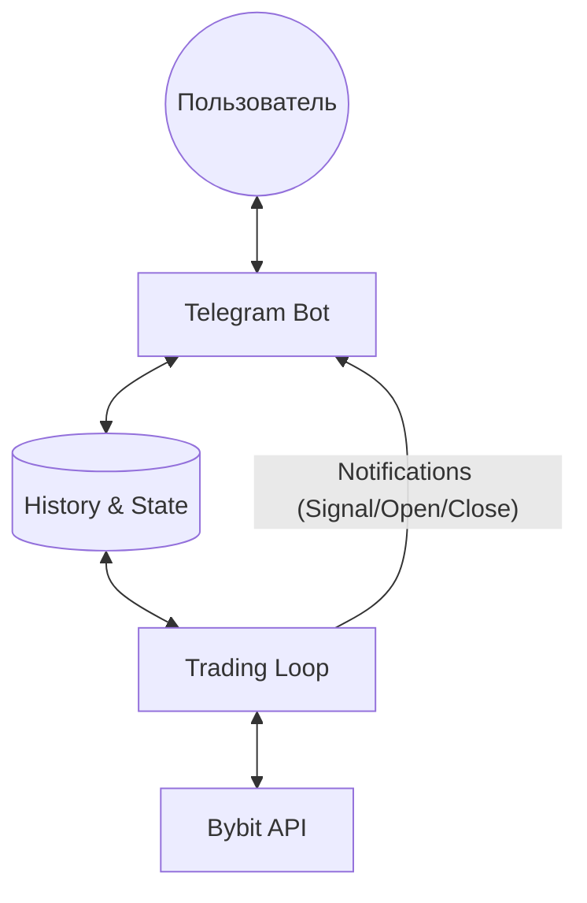

# План реализации Telegram-управления, истории и интерактивного управления моделями

Этот план расширяет возможности бота за счет ведения детальной истории, мониторинга позиций в реальном времени и инструментов для оптимизации ML-моделей.

## 1. Окружение и конфигурация

- Установка `python-telegram-bot`.
- Обновление [`bot/config.py`](bot/config.py):
    - Добавление `TELEGRAM_TOKEN`, `ALLOWED_USER_ID`.
    - Настройка путей для БД/файлов истории.

## 2. Ведение истории и состояние

- Создание [`bot/state.py`](bot/state.py):
    - **BotState**: Список `active_symbols` (до 5), текущие модели, статус работы.
    - **SignalTracker**: Логирование всех предсказаний ML.
    - **TradeLogger**: Детальный лог исполненных сделок.
    - **PositionTracker**: Мониторинг текущих открытых позиций (цена входа, размер, маржа, текущий PnL).

## 3. Модуль интерактивного управления моделями

- Сервис обучения с бэктест-отчетом и кнопками `[ ✅ Принять новую ] [ ❌ Оставить текущую ]`.

## 4. Реализация Telegram-бота

- Создание [`bot/telegram_bot.py`](bot/telegram_bot.py):
    - **Мгновенные уведомления**:
        - 🔔 **Новый сигнал**: когда ML выдает сигнал высокой уверенности.
        - 🚀 **Открытие позиции**: детали ордера, цена входа, TP/SL.
        - 🏁 **Закрытие позиции**: результат сделки, зафиксированный PnL.
    - **Информативный Статус (как на скриншоте)**:
        Детальный отчет по кнопке или `/status`:
        ```
        💰 ACCOUNT INFO:
        Баланс: $1045.50 | Доступно: $200.00
        Общий PnL: -$563.31 (за всё время)
        
        📊 OPEN POSITIONS:
        Символ: BTCUSDT (10x) | Side: LONG
        Размер: 0.05 BTC | Маржа: $45.00
        Вход: $65,000 | Тек: $65,500
        PnL: +$25.00 (+0.77%)
        TP: $67,000 | SL: $64,000
        
        📈 ACTIVE STRATEGY:
        Пара: BTCUSDT | Модель: Ensemble_v2
        Пара: ETHUSDT | Модель: XGBoost_Final
        ```
    - **Меню управления**: Настройка пар, переобучение моделей, история.

## 5. Торговый цикл (Trading Loop)

- Создание [`bot/trading_loop.py`](bot/trading_loop.py):
    - Основной цикл обработки до 5 пар.
    - Интеграция с Telegram-ботом для отправки уведомлений в реальном времени.
    - Обновление данных о текущих позициях через `BybitClient` для точного отображения в статусе.

## 6. Точка входа

- [`run_bot.py`](run_bot.py): Запуск Telegram-интерфейса и торговой логики.


